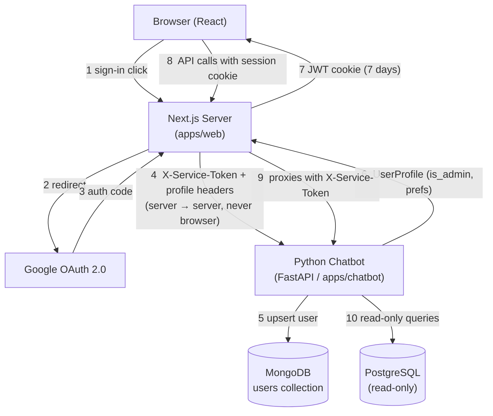
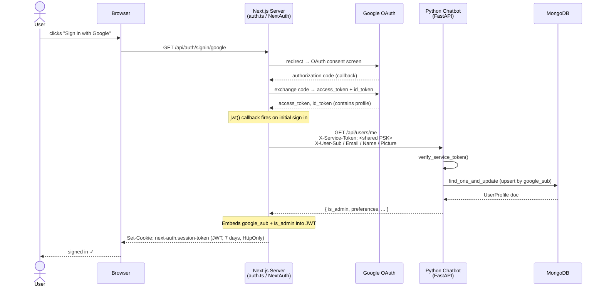
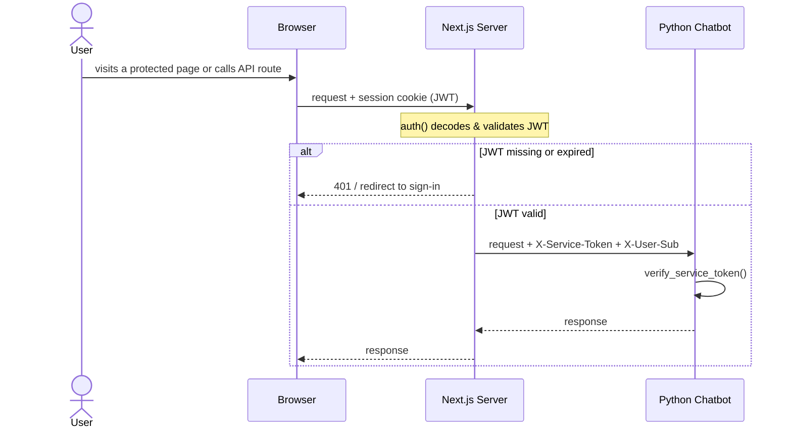
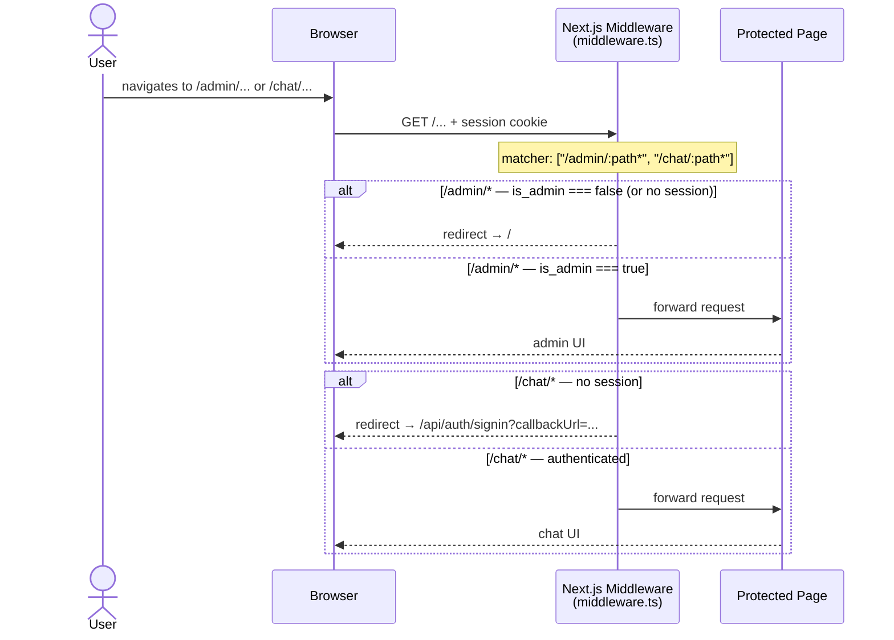

# Authentication Architecture

This document explains how auth works across the ICC Rankings stack — Google OAuth,
JWTs, the service-to-service token, and the admin guard.

---

## High-level overview



---

## Sign-in sequence (step by step)



---

## Authenticated request sequence



---

## Route guards (middleware.ts)

The middleware protects two route groups:



---

## Key concepts explained

### JWT session (not a database session)

NextAuth is configured with `strategy: "jwt"`. This means:

- **No session table** — the entire session lives in a signed, encrypted cookie.
- The cookie is `HttpOnly` (JS cannot read it) and lasts **7 days**.
- `is_admin` and `is_new_user` are baked into the JWT at sign-in time. If you promote
  someone to admin in MongoDB, they need to sign out and sign back in for it to take effect.
- `is_new_user` is `true` only on the very first sign-in (detected via `$setOnInsert._is_new`
  in MongoDB). Subsequent sign-ins will have `is_new_user: false`.

### Service-to-service token (`X-Service-Token`)

The Python chatbot's `/api/users/*` routes are **not** meant to be called by the
browser. They are only called by the Next.js server process. The shared secret
(`SERVICE_API_TOKEN` env var) acts as a PSK (pre-shared key) to prove "this request
came from our Next.js server, not from an untrusted client."

```
Browser  →  Next.js server  →  (adds X-Service-Token)  →  Python chatbot
   ↑                                                              |
   |__________________ response flows back ______________________|
```

The chatbot uses `secrets.compare_digest` (constant-time comparison) to check the
token, which prevents timing attacks.

### `google_sub` as the user identity

Google's `sub` claim is a stable, unique identifier for a Google account. It never
changes, even if the user changes their email. It is used as the primary key in the
MongoDB `users` collection and is embedded in the JWT so every server-side call can
identify the user without a DB lookup.

### What the browser never sees

| Secret | Where it lives |
|---|---|
| `GOOGLE_CLIENT_SECRET` | Next.js server env only |
| `SERVICE_API_TOKEN` | Next.js server env + Chatbot env |
| MongoDB credentials | Chatbot env only |
| Raw JWT signing key | Next.js server env (`NEXTAUTH_SECRET`) |

The browser only ever holds the **encrypted session cookie**. It cannot read the JWT
payload or any of the secrets above.

---

## Environment variables required

### `apps/web/.env.local`

| Variable | Purpose |
|---|---|
| `GOOGLE_CLIENT_ID` | OAuth app client ID from Google Cloud Console |
| `GOOGLE_CLIENT_SECRET` | OAuth app client secret |
| `NEXTAUTH_SECRET` | Random secret used to sign/encrypt JWTs (generate with `openssl rand -base64 32`) |
| `NEXTAUTH_URL` | Public URL of the Next.js app (e.g. `http://localhost:5237`) |
| `INTERNAL_CHATBOT_URL` | Internal URL of the chatbot service (e.g. `http://localhost:8100`) |
| `SERVICE_API_TOKEN` | Shared PSK — must match the chatbot's value |

### `apps/chatbot/.env`

| Variable | Purpose |
|---|---|
| `SERVICE_API_TOKEN` | Shared PSK — must match the web app's value |
| `ANTHROPIC_API_KEY` | Claude API key for LangGraph agents |
| `MONGODB_URL` | Connection string for MongoDB |

See `docs/google-oauth-setup.md` for how to create the Google OAuth credentials.

---

## Sign-in flow and welcome banner

After a successful sign-in via the header "Sign in" button, the user is redirected to
`/?welcome=1`. The `WelcomeBanner` component (`components/home/welcome-banner.tsx`) detects
this param and shows a personalised greeting:

- **New user** (`is_new_user: true`): gold banner — "Welcome to ICC Rankings, [name]!"
- **Returning user** (`is_new_user: false`): purple banner — "Welcome back, [name]!"

The banner auto-dismisses after 6 seconds and strips `?welcome=1` from the URL.

> Note: if a user is redirected to `/chat` via the middleware (e.g. they visited `/chat` while
> logged out), after sign-in they return to `/chat` — not to `/?welcome=1`. The `callbackUrl`
> set by the middleware takes precedence.

---

## Multi-session chat history

Conversations in MongoDB are tagged with `user_id` (the user's `google_sub`) when
the request includes a `user_id` in the `ChatRequest` body. The `/api/users/sessions`
endpoint (service-token protected) returns a user's past sessions, newest first.

The Next.js proxy at `/api/chat/sessions` calls this endpoint server-side using the
authenticated user's `google_sub` from the session.

Session IDs are always UUIDs (not the google_sub itself). The active session ID is
stored in `localStorage` under `twelfth_man_active_session`.
